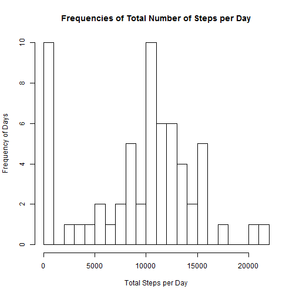
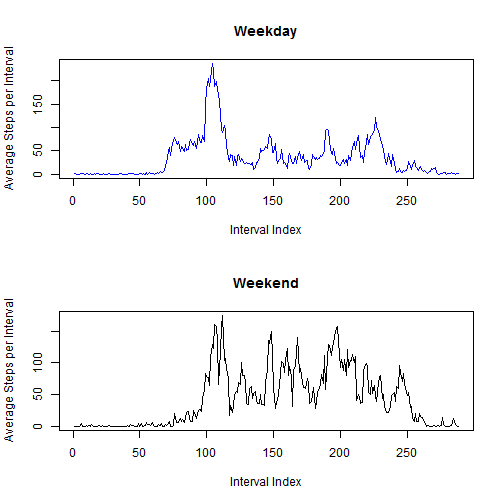
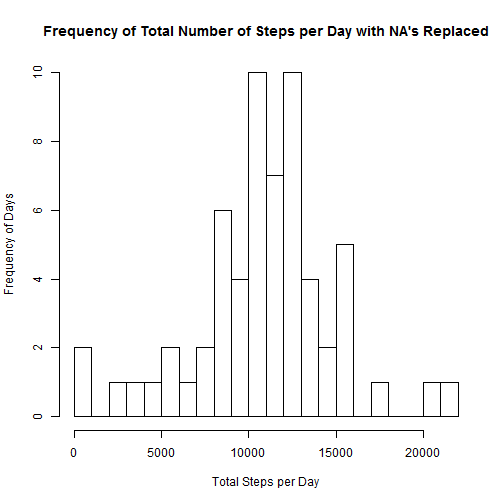
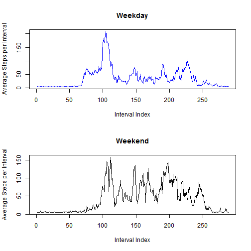

PA1_template
========================================================

This markdown file answers the questions of Peer Assessment Assignment1.

Note, the activity.csv dataset must be loaded in the working directory before beginning.

The first step is to load the data and add new column that contains the day name:

```r
df <- read.csv("activity.csv", header = TRUE, stringsAsFactors = FALSE)
```


Next, let's review the data to get a sense of what the data looks like.

The total number of observations are:

```r
nrow(df)
```

```
## [1] 17568
```


The number of complete cases and incomplete cases, respectively, are:

```r
sum(complete.cases(df))
```

```
## [1] 15264
```

```r

sum(!complete.cases(df))
```

```
## [1] 2304
```


Incomplete cases make up:

```r
sum(!complete.cases(df))/nrow(df)
```

```
## [1] 0.1311
```

of the total observations.

A summary of the data yields the following results:

```r
summary(df$steps)
```

```
##    Min. 1st Qu.  Median    Mean 3rd Qu.    Max.    NA's 
##     0.0     0.0     0.0    37.4    12.0   806.0    2304
```


From the summary results we can see the data is positively skewed.  Also, given the minimum, median,
and the first quartile are all 0, there seems to a leverage point around 0.  

The number of ovservations that have 0 entered for the number of steps are:

```r
sum(df$steps == 0, na.rm = TRUE)
```

```
## [1] 11014
```

Observations make up:

```r
sum(df$steps == 0, na.rm = TRUE)/nrow(df)
```

```
## [1] 0.6269
```

of the total observations.

Because the data reports the same intervals across multiple days, to make meaningful interpretations from the data, the data should be aggregated across days or intervals.

Let's calculate the total number of steps taken per day and plot the output in a histogram, which will show the freqency for buckets of steps taken.

```r
total <- sapply(split(df$steps, df$date), sum, na.rm = TRUE)
hist(total, main = "Frequencies of Total Number of Steps per Day", xlab = "Total Steps per Day", 
    ylab = "Frequency of Days", breaks = 20)
```

 


Next, let's calculate and report the mean and median across all days.  The mean and median,
respectively, are:

Mean:

```r
mean(total)
```

```
## [1] 9354
```


Median:

```r
median(total)
```

```
## [1] 10395
```


Next, let's examine the average steps taken across intervals across all days, which requires calculating the mean number of steps taken during each interval across all days and the plotting the line graph.

```r
interval <- sapply(split(df$steps, df$interval), mean, na.rm = TRUE)
plot(interval, type = "l", main = "Interval Average Number of Steps", xlab = "Interval", 
    ylab = "Number of Steps")
```

 


To extract the maximum value and the interval from the average number of steps across all intervals, we must
transform table stored in the interval variable into a data frame.

```r
df_inter <- as.data.frame(interval)
```


Which looks like:

```r
head(df_inter)
```

```
##    interval
## 0   1.71698
## 5   0.33962
## 10  0.13208
## 15  0.15094
## 20  0.07547
## 25  2.09434
```


The maximum average across all intervals is and its associated interval are:
Maximum average:

```r
max(df_inter$interval)
```

```
## [1] 206.2
```

Related interval:

```r
rownames(df_inter)[df_inter$interval == max(df_inter$interval)]
```

```
## [1] "835"
```


Also, as discussed above, the data set had a number of missing values in the steps column.  To remind the reader, the number of incomplete cases (missing values) are:

```r
sum(!complete.cases(df))
```

```
## [1] 2304
```


To address the missing values, this next step calculates the mean number of steps taken across each day (e.g. Monday's, Tuesday's, etc) and replace the missing values with mean for the given day of the week.  

The first step is to assign the appropriate day of the week to the date.

```r
df$day <- weekdays(as.Date(df$date, "%m/%d/%Y"))
```


Next, the average values for each day of the week are calculated and will replace the missing values:

```r
mu <- sapply(split(df$steps, df$day), mean, na.rm = TRUE)

muFriday <- mu[["Friday"]]
muSaturday <- mu[["Saturday"]]
muSunday <- mu[["Sunday"]]
muMonday <- mu[["Monday"]]
muTuesday <- mu[["Tuesday"]]
muWednesday <- mu[["Wednesday"]]
muThursday <- mu[["Thursday"]]

df$steps[is.na(df$steps) & df$day == "Friday"] <- muFriday
df$steps[is.na(df$steps) & df$day == "Saturday"] <- muSaturday
df$steps[is.na(df$steps) & df$day == "Sunday"] <- muSunday
df$steps[is.na(df$steps) & df$day == "Monday"] <- muMonday
df$steps[is.na(df$steps) & df$day == "Tuesday"] <- muTuesday
df$steps[is.na(df$steps) & df$day == "Wednesday"] <- muWednesday
df$steps[is.na(df$steps) & df$day == "Thursday"] <- muThursday
```


We can see the process was successful by counting the number of incomplete cases after replacement, which should be 0.

```r
sum(!complete.cases(df))
```

```
## [1] 0
```

Once the missing values have been replaced, the total number of steps per day and the histogram is also replotted.

```r
total <- sapply(split(df$steps, df$date), sum, na.rm = TRUE)
hist(total, main = "Frequency of Total Number of Steps per Day with NA's Replaced", 
    xlab = "Total Steps per Day", ylab = "Frequency of Days", breaks = 20)
```

 


The mean and median for all days are recalculated:

Recalculated Mean:

```r
mean(total)
```

```
## [1] 10821
```


Recalculated Median:

```r
median(total)
```

```
## [1] 11015
```

Median and mean are higher after replacing the values.


The final portion of the analysis examines differences between weekends and weekdays.  The first step is divide the days across weekends and weekdays.  This analysis then creates separate data sets made up only of weekend or weekday observations.


```r
df$weekend[df$day != "Saturday" & df$day != "Sunday"] <- "Weekday"
df$weekend[df$day == "Saturday" | df$day == "Sunday"] <- "Weekend"

weekend <- df[df$weekend == "Weekend", ]
weekday <- df[df$weekend == "Weekday", ]
```


The next step is to calucale the mean of each interval across all weekend and weekday days, compare the interal and maximum average steps per interval of weekends and weekdays,  and plot the results.

```r
muWeekend <- sapply(split(weekend$steps, weekend$interval), mean, na.rm = FALSE)
muWeekday <- sapply(split(weekday$steps, weekday$interval), mean, na.rm = FALSE)
```


To get the maximum average steps and that value's respective interval, the muWeekend and muWeedays tables are converted to data frames and the maximum values and intervals identified.

```r
df_Weekend <- as.data.frame(muWeekend)
df_Weekday <- as.data.frame(muWeekday)
```


Weekdays (max value and interval):

```r
max(df_Weekday$muWeekday)
```

```
## [1] 207.9
```

```r
rownames(df_Weekday)[df_Weekday$muWeekday == max(df_Weekday$muWeekday)]
```

```
## [1] "835"
```


Weekends (max value and interval):

```r
max(df_Weekend$muWeekend)
```

```
## [1] 158.5
```

```r
rownames(df_Weekend)[df_Weekend$muWeekend == max(df_Weekend$muWeekend)]
```

```
## [1] "915"
```

From this comparison we see that weekdays have the highest average number of steps for a given interval and the interval is a little earlier in the morning compared to weekends.

A plot shows compares activity between weekdays and weekends.


```r
par(mfrow = c(2, 1))
plot(muWeekday, type = "l", main = "Weekday", col = "blue", ylab = "Average Steps per Interval", 
    xlab = "Interval Index")
plot(muWeekend, type = "l", main = "Weekend", ylab = "Average Steps per Interval", 
    xlab = "Interval Index")
```

 


Although weekdays have the highest peak average for all intervals, weekends show greater consistency of activity throughout the day, as shown by a comparison of the average number of steps across all intervals for each part of the week.

Mean of all intervals for weekdays:

```r
mean(muWeekday)
```

```
## [1] 35.62
```

  
Mean of all intervals for weekends:

```r
mean(muWeekend)
```

```
## [1] 43.08
```


Thus, we see activity is higher on average throughout weekend days than on weekdays.
