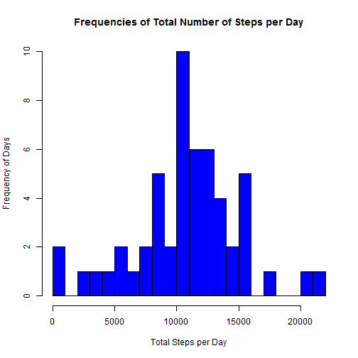

# PA1_template
========================================================

This markdown file answers the questions of Peer Assessment Assignment1.

## Load and Review the Data
==========================

```r
dir <- getwd()
subdir <- "activity"

setInternet2(use = TRUE)

if (!file.exists(file.path(dir, subdir))) {
    dir.create(file.path(dir, subdir), mode = "0777")
}

setwd(file.path(dir, subdir))
path <- file.path(getwd(), "activity.zip")
url <- ("https://d396qusza40orc.cloudfront.net/repdata%2Fdata%2Factivity.zip")
download.file(url, path)
con <- unzip(path, "activity.csv")
df <- read.csv(con, header = TRUE, stringsAsFactors = FALSE)
```


The number of observations are 17568.

### Number of Complete and Incomplete Cases:
===========================================

**Complete Cases:** 15264

**Incomplete Cases:** 2304

**Percent of Data is Incomplete:** 13.1148%

### Five Number Summary: 
========================

```r
summary(df$steps)
```

```
##    Min. 1st Qu.  Median    Mean 3rd Qu.    Max.    NA's 
##     0.0     0.0     0.0    37.4    12.0   806.0    2304
```


The number of observations with 0 entered for the number of steps are 11014.

This makes up 62.6935% of the total observations.

## Total Number of Steps Per Day and Histogram without Addressing NA Values
===========================================================================

```r
total <- sapply(split(df$steps, df$date), sum, na.rm = FALSE)
hist(total, main = "Frequencies of Total Number of Steps per Day", xlab = "Total Steps per Day", 
    ylab = "Frequency of Days", breaks = 20, col = "blue")
```

 


### Mean and Median Across All Days
===================================


**Mean:** 10766

**Median:** 10765

## Line Graph of Average Steps Across Each Interval
====================================================

```r
interval <- sapply(split(df$steps, df$interval), mean, na.rm = TRUE)
plot(interval, type = "l", main = "Interval Average Number of Steps", xlab = "Interval Index", 
    ylab = "Number of Steps", col = "forestgreen")
```

 


### Maximum Average Number of Steps Per Interval and the Associated Interval
=============================================================================

Transform list data into a data frame and review the new
data frame. 

```r
head(df_inter)
```

```
##    interval
## 0   1.71698
## 5   0.33962
## 10  0.13208
## 15  0.15094
## 20  0.07547
## 25  2.09434
```


**Maximum Average of Steps per Interval:** 206.1698

**Associated interval:** 835


## Describe and Execute Method for Imputing Missing Values
==========================================================

To address the missing values, these next steps calculate the mean number of steps taken across each interval for each day of the week and replace the missing values with the mean for the given the interval of the given day (i.e. calculate mean's by weekday and interval and replace missing values with those means).  


```r
df$day <- weekdays(as.Date(df$date, "%Y-%m-%d"))

head(df$day)
```

```
## [1] "Monday" "Monday" "Monday" "Monday" "Monday" "Monday"
```


Next, the average values for each interval for each weekday are calculated, missing values are replaced,and a tidy data set is output:

```r

df0 <- df[is.na(df$steps), ]
df1 <- df[!is.na(df$steps), ]

avgs <- aggregate(steps ~ interval + day, FUN = "mean", data = df, na.rm = TRUE)

df2 <- merge(avgs, df0, by = c("day", "interval"), all.y = TRUE)
df2 <- df2[order(df2$date, df2$interval), ]
df2$steps <- df2$steps.x

rownames(df2) <- NULL

df2 <- df2[c("date", "interval", "day", "steps")]

df <- rbind(df1, df2)

write.csv(df, "steps.csv", row.names = FALSE)
```


We can see the process was successful by counting the number of incomplete cases after replacement, which should be 0.

```r
sum(!complete.cases(df))
```

```
## [1] 0
```


### Replotted Histogram and Recalculated Mean and Median after Replacing NA's
=============================================================================


```r
total <- sapply(split(df$steps, df$date), sum, na.rm = FALSE)
hist(total, main = "Frequency of Total Number of Steps per Day with NA's Replaced", 
    xlab = "Total Steps per Day", ylab = "Frequency of Days", breaks = 20, col = "red")
```

 


**Recalculated Mean:** 10821

**Recalculated Median:** 11015

Median and mean are higher after replacing the values.


## Differences Between Weekday and Weekend Activity
===================================================


```r
df$weekend[df$day != "Saturday" & df$day != "Sunday"] <- "Weekday"
df$weekend[df$day == "Saturday" | df$day == "Sunday"] <- "Weekend"

weekend <- df[df$weekend == "Weekend", ]
weekday <- df[df$weekend == "Weekday", ]
```


The next step is to calculate the mean of each interval across all weekend and weekday days, compare the interval and maximum average steps per interval of weekends and weekdays, and plot the results.

```r
muWeekend <- sapply(split(weekend$steps, weekend$interval), mean, na.rm = FALSE)
muWeekday <- sapply(split(weekday$steps, weekday$interval), mean, na.rm = FALSE)
df_Weekend <- as.data.frame(muWeekend)
df_Weekday <- as.data.frame(muWeekday)
```


### Maximum Average Values and Associated Intervals for Weekends and Weekdays
==============================================================================

**Weekdays (Max Value):** 237.0028

**Weekdays (Interval):** 835

**Weekends (Max Value):** 175

**Weekends (Interval):** 915

Weekdays have the highest average number of steps for a given interval and the interval of maximum value is a little earlier in the morning compared to weekends.

This plot compares activity between weekdays and weekends.


```r
par(mfrow = c(2, 1))
plot(muWeekday, type = "l", main = "Weekday", col = "blue", ylab = "Average Steps per Interval", 
    xlab = "Interval Index")
plot(muWeekend, type = "l", main = "Weekend", ylab = "Average Steps per Interval", 
    xlab = "Interval Index")
```

 


### Mean of all intervals for weekdays:
=======================================
**35.6164**
  
### Mean of all intervals for weekends:
========================================
**43.0784**

## Conclusions on Differences between Weekend and Weekday Activity
====================================================================
Although weekdays have the highest peak average for all intervals, weekends show greater consistency of activity throughout the day, as shown by a comparison of the average number of steps across all intervals for each part of the week.  Also, the weekday peak happens earlier in the day compared to weekend activity peak.  


